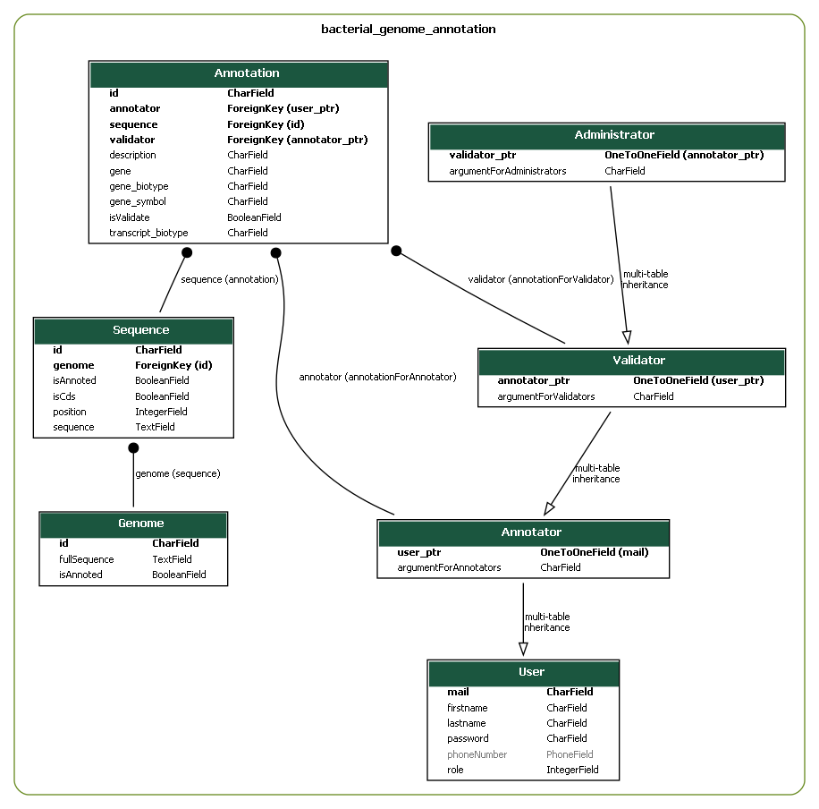

# Projet web

Web project of 2022-2023 in master AMI2B. The purpose is to build a web application with django to allow users to create and view annotations of bacterial genome.

## Environnement

We used for this project [python 3.9.12](https://www.python.org/downloads/release/python-3912/). The list of external modules, including [django](https://www.djangoproject.com), is available in [the requirements file](requirements.txt). To install them directly, just run : 
```
pip install -r "requirements.txt"
```

## Classes

Here is the UML class diagram, obtained directly from [django-extensions](https://django-extensions.readthedocs.io/en/latest/graph_models.html?highlight=graph).



To recreate it, just run the two commands bellow:

```
python webapp/manage.py graph_models -g --dot -o webapp/uml/diagram.dot bacterial_genome_annotation

dot -Tpng webapp/uml/diagram.dot -o webapp/uml/diagram.png
```