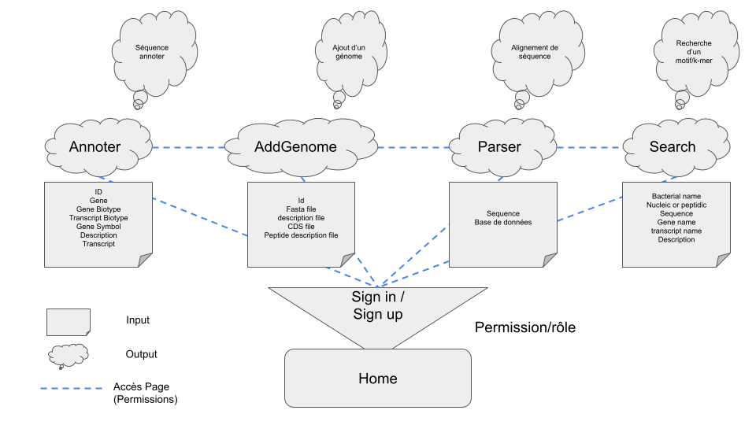
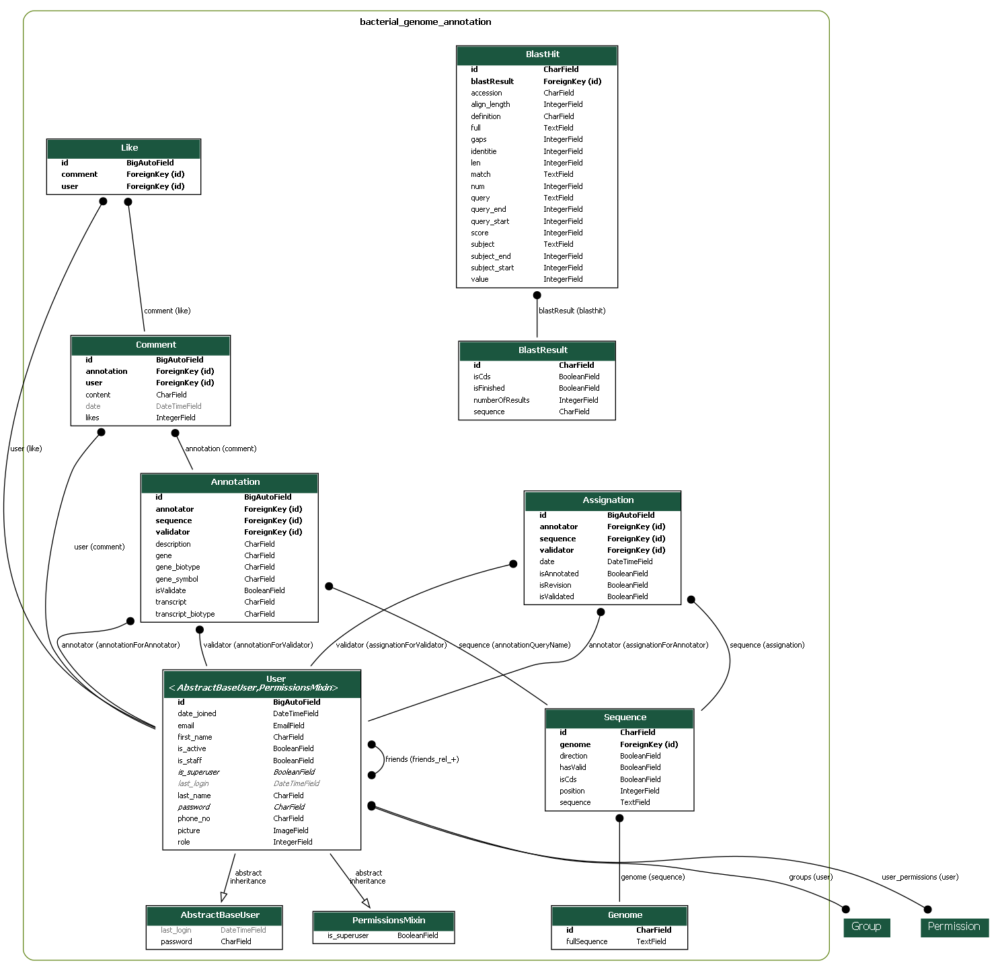

# Projet web

Web project of 2022-2023 in master AMI2B. The purpose is to build a web application with django to allow users to create and view annotations of bacterial genome. The site is still in confection, please refer to the [todo list](TODO.md) to follow the progress.

## Environnement

We used for this project [python 3.9.12](https://www.python.org/downloads/release/python-3912/). The list of external modules, including [django 4.1.4](https://www.djangoproject.com), is available in [the requirements file](requirements.txt). To install them directly, just run : 
```
pip install -r "requirements.txt"
```

## Run the server

To run the server, be sure you have all the required packages installed (see [requirements.txt](requirements.txt)) and the data folder at the root. You can perform `python source/manage.py initialize-server` to initialize the database, and then just run the server with `python source/manage.py runserver`.

## How the site works

### Permissions

Permissions are granted according to roles (Readers, Annotators, Validators, Admins).

- **Readers** can only use the search functions on the site and comment on the annotations. This is the default group when you sign in.

- **Annotators** can upload annotations for each sequence, and can propose another annotation if they think the current one is outdated. Annotators can promote anyone to annotator.

- **Validators** can validate or not any annotation. An annotation considered as not validated is deleted.

- **Admins** can do anything on the website. They can promote anyone to any group, and they are the only ones who can downgrade and ban people. They can manage the database as they want, by adding or deleting sequences, annotations or comments.

### Pages

You can have acces to the html pages in [templates](source/bacterial_genome_annotation/templates/). From the [home page](source/bacterial_genome_annotation/templates/bacterial_genome_annotation/Base.html) you have acces to :

- [**login**](source/bacterial_genome_annotation/templates/registration/login.html), which is simply the login page.
- [**register**](source/bacterial_genome_annotation/templates/registration/signup.html),where you can sign in.
- [**account**](source/bacterial_genome_annotation/templates/bacterial_genome_annotation/Account.html), where you can manage your account.
- [**annotate**](source/bacterial_genome_annotation/templates/bacterial_genome_annotation/annoter.html), where you can annotate a sequence. 
- [**addgenome**](source/bacterial_genome_annotation/templates/bacterial_genome_annotation/AddGenome.html) where you can upload a genome.
- [**parser**](source/bacterial_genome_annotation/templates/bacterial_genome_annotation/Parser.html) where you can blast a sequence against the ncbi database. The blast is implemented but not the visualisation.
- [**search**](source/bacterial_genome_annotation/templates/bacterial_genome_annotation/search.html) where you can look for a sequence from differents entries such as the genome, the gene, the description or a k-mer. You can click on any sequence to view the next page : sequence.
- [**search/sequence&id=<seq.id>**](source/bacterial_genome_annotation/templates/bacterial_genome_annotation/sequence.html) where you find the annotations and informations about the sequence with seq.id as id, and you can click on *BLAST*, which will redirect you to *parser* with the blast of the sequence against the ncbi database.

### Site schema



## Import data

### Genomes

You must put the data folder at the root of the project (where you find doc and source). You can run `python source/manage.py import-my-data` to import the genome and annotations.
Note that it is also possible to compress the data using the functions in [utils.py](source/bacterial_genome_annotation/utils.py) to gain around 10 Mo.

### Users

You can run `python source/manage.py create-groups` and `python source/manage.py create-users` to create a bunch of example users, groups and permissions. Their logins and password are stored in [default_users.txt](source/bacterial_genome_annotation/assets/default_users.txt). You can change or add lines in this file to custom the creation of users. The admin is the *superuser* (different from firstAdmin@gmail.com) and you can login as him in [the admin site](http://127.0.0.1:8000/admin) by default with :

login :     `admin@admin.com`
password :  `Ac1net0bactErb@umannii`

## Classes

Here is the UML class diagram, obtained directly from [django-extensions](https://django-extensions.readthedocs.io/en/latest/graph_models.html?highlight=graph).



To recreate it, just run the two commands bellow:

```
python source/manage.py graph_models -g --dot -o doc/uml/diagram.dot bacterial_genome_annotation

dot -Tpng doc/uml/diagram.dot -o doc/uml/diagram.png
```
